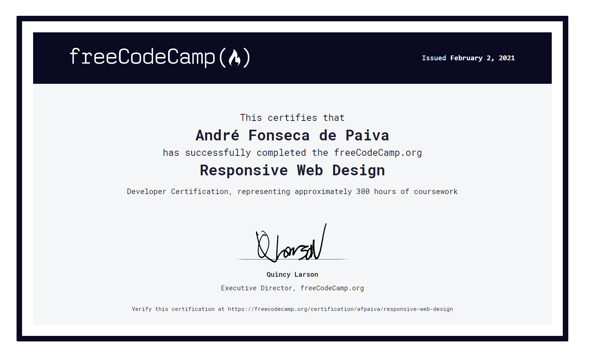

# freeCodeCamp(🔥)

I've been using this repository for freeCodeCamp(🔥) challenges and studies.

## 🧪 Final Tests (JavaScript Algorithms and Data Structures)

JavaScript challenges done.

- [Palindrome Checker](https://github.com/afpaiva/freecodecamp/blob/main/javaScriptDataStructures/PalindromeChecker.js)
- [Roman Numeral Converter](https://github.com/afpaiva/freecodecamp/blob/main/javaScriptDataStructures/RomanNumeralConverter.js)
- [Caesars Cipher](https://github.com/afpaiva/freecodecamp/blob/main/javaScriptDataStructures/CaesarsCipher.js)
- [Telephone Number Validator](https://github.com/afpaiva/freecodecamp/blob/main/javaScriptDataStructures/TelephoneNumberValidator.js)
- [Cash Register](https://github.com/afpaiva/freecodecamp/blob/main/javaScriptDataStructures/CashRegister.js) - made by freeCodeCamp

## 🧪 Final Tests (Responsive Webdesign course)

All of these tests were made following rules and restrictions, as seen on readme inside of each sub-folder.

- [Company Test](https://afpaiva.github.io/freecodecamp/frontEndTests/companyTest/)
- [Documentation Test](https://afpaiva.github.io/freecodecamp/frontEndTests/documentationTest/)
- [Portfolio Test](https://afpaiva.github.io/freecodecamp/frontEndTests/portfolioTest/)
- [Survey Test](https://afpaiva.github.io/freecodecamp/frontEndTests/surveyTest/)
- [Tribute Page Test](https://afpaiva.github.io/freecodecamp/frontEndTests/tributePageTest/)

